# Module 8 복습노트: Task-Oriented Dialogue에서 LLM Agent와 CMF Generation까지

> 이 노트의 핵심 질문: **자연어로 표현된 사용자의 의도를 어떻게 정확한 상태와 행동으로 바꿀 것인가?**

---

## 0. 한눈에 보는 Module 8

Module 8은 단순히 “챗봇이 말을 잘하는 법”을 다루는 모듈이 아니다. 핵심은 **언어를 실제 업무 수행으로 연결하는 시스템**이다.

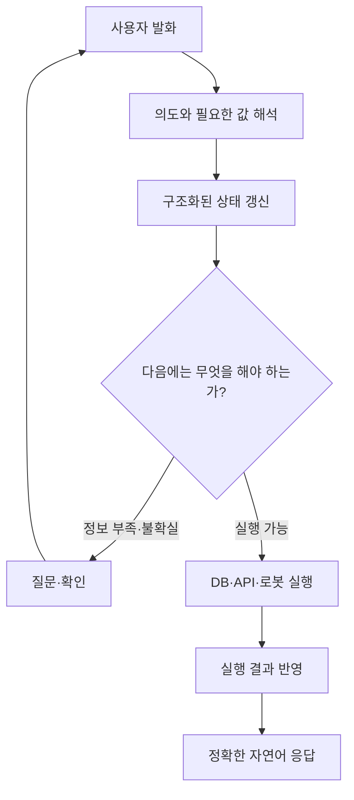

가장 압축하면 다음 일곱 단계다.

1. 사용자가 무엇을 원하는지 파악한다.
2. 실행에 필요한 정보를 구조화한다.
3. 여러 turn 동안 그 정보를 기억하고 수정한다.
4. 빠졌거나 애매한 값은 질문한다.
5. 현재 상태에 맞는 다음 행동을 선택한다.
6. DB·API·로봇 같은 외부 시스템을 실행한다.
7. 실행 결과를 빠뜨리거나 꾸며내지 않고 설명한다.

> **Task-oriented dialogue의 목적은 자연스러운 대화 자체가 아니라 task completion이다.**

---

## 1. Open-domain chatbot과 Task-oriented dialogue의 차이

| 구분 | Open-domain dialogue | Task-oriented dialogue |
|---|---|---|
| 목적 | 자유로운 대화, 정보 제공 | 예약·주문·검색·설정 등 목표 달성 |
| 가능한 주제 | 매우 넓음 | 특정 domain과 업무로 제한 |
| 중요한 내부 정보 | 대화 문맥 | 대화 문맥 + 구조화된 task state |
| 실패의 의미 | 답변이 부자연스럽거나 부정확함 | 실제 예약·결제·행동이 틀릴 수 있음 |
| 핵심 평가 | 유용성, 자연스러움, 정확성 | task success, slot/state accuracy, 안전성 |

예를 들어 사용자가 다음과 같이 말한다.

> “내일 저녁 7시에 강남에서 두 명이 갈 일식집 예약해줘.”

Task-oriented system은 이 문장을 그냥 잘 이해한 듯 답하는 데서 끝나면 안 된다. 실제 예약 API가 사용할 수 있는 형태로 바꿔야 한다.

```python
{
    "intent": "reserve_restaurant",
    "location": "강남",
    "date": "내일",
    "time": "19:00",
    "party_size": 2,
    "cuisine": "일식"
}
```

즉, 이 시스템에서 자연어는 **입력 인터페이스**이고 구조화된 state는 **실제 업무의 기준 정보**다.

---

## 2. 전체 고전 Pipeline

전통적인 task-oriented dialogue system은 기능을 명확히 분리했다.

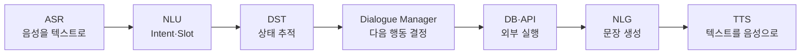

텍스트 챗봇에서는 ASR과 TTS가 없을 수 있지만, 가운데 구조는 동일하다.

| 구성 요소 | 질문 | 출력 예시 |
|---|---|---|
| NLU | 사용자가 무엇을 원하며 어떤 값을 말했는가? | `intent=reserve`, `time=19:00` |
| DST | 지금까지 확정·추정된 정보는 무엇인가? | `date=내일`, `time=19:00`, `cuisine=?` |
| Dialogue Policy | 지금 질문할까, 검색할까, 실행할까? | `request(cuisine)` |
| DB/API | 실제 세계에서 무엇을 수행할까? | 식당 검색, 예약 요청 |
| NLG | 결과를 어떻게 정확하게 말할까? | “오후 7시 두 분으로 예약했습니다.” |

### 중요한 관점

이 pipeline의 각 단계는 단지 구현 편의를 위한 분리가 아니다. 서로 다른 종류의 오류를 추적하고 통제하기 위한 경계이기도 하다.

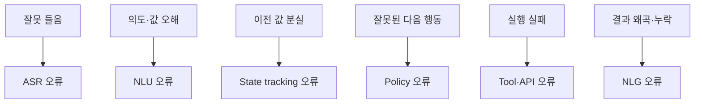

---

## 3. Domain, Intent, Slot, Frame

### 3.1 Domain

**어떤 업무 세계에 속하는가?**

- restaurant
- hotel
- flight
- banking
- smart-home
- CMF generation

Domain은 사용할 수 있는 intent, slot, backend action의 범위를 제한한다.

### 3.2 Intent

**사용자가 궁극적으로 무엇을 하려는가?**

```text
reserve_restaurant
search_restaurant
cancel_booking
change_booking
```

Intent는 문장의 표면적 형태가 아니라 행동 목적이다.

```text
“예약 좀 해줘.”
“내일 저녁 자리 잡아줄래?”
“두 명 갈 건데 스시하나 가능해?”
```

표현은 다르지만 문맥에 따라 모두 `reserve_restaurant`일 수 있다.

### 3.3 Slot

**그 행동을 실행하기 위해 필요한 입력값은 무엇인가?**

```python
{
    "restaurant_name": "스시하나",
    "date": "내일",
    "time": "19:00",
    "party_size": 2
}
```

Slot은 함수의 argument와 닮았지만 완전히 같지는 않다. Slot은 여러 turn에 걸쳐 수집·수정·확인될 수 있는 **대화 상태의 구성 요소**다.

### 3.4 Frame

**하나의 task를 수행하는 데 필요한 intent와 slot 묶음**이다.

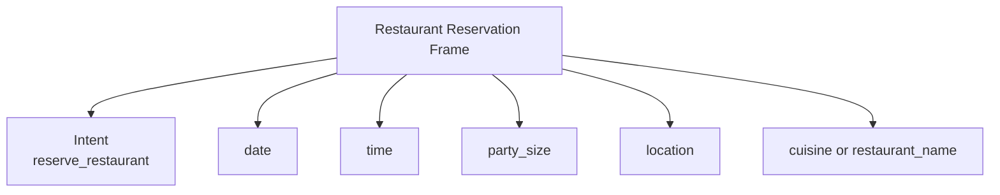

Frame은 업무 양식에 가깝다. 어떤 값이 필수이고, 어떤 값이 선택이며, 어떤 제약과 검증이 필요한지를 정의한다.

### 용어 관계 한 번에 보기

| 개념 | 쉬운 뜻 | 예약 예시 | CMF 예시 |
|---|---|---|---|
| Domain | 업무 세계 | restaurant | CMF generation |
| Intent | 하려는 일 | 예약하기 | variation 생성하기 |
| Slot | 필요한 입력값 | 날짜, 시간, 인원 | 색상, 재질, 광택, 보존 영역 |
| Frame | 한 task의 양식 | 예약 요청서 | CMF generation spec |

---

## 4. Dialogue Context와 Belief State는 다르다

여기서 가장 중요한 구분 중 하나다.

### Dialogue context

지금까지 오간 **원문 대화**다.

```text
사용자: 강남에서 일식집 찾아줘.
시스템: 언제 가실 예정인가요?
사용자: 내일 저녁 7시.
시스템: 몇 분이신가요?
사용자: 두 명이요.
```

### Belief state

시스템이 현재 믿고 있는 **구조화된 task 상태**다.

```python
{
    "intent": "search_or_reserve_restaurant",
    "location": "강남",
    "cuisine": "일식",
    "date": "내일",
    "time": "19:00",
    "party_size": 2,
    "reservation_confirmed": False
}
```

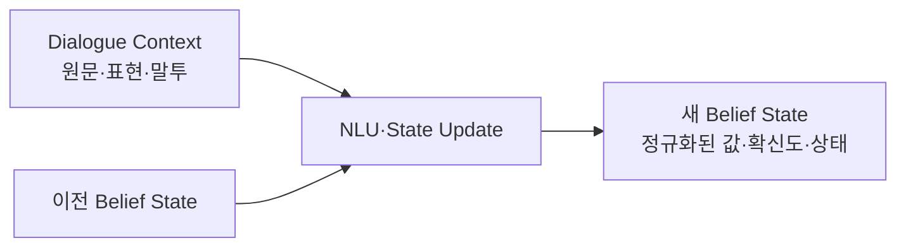

### 왜 원문만 기억하면 부족한가?

대화 원문에는 다음 문제가 있다.

- 같은 정보를 여러 방식으로 표현한다.
- 사용자가 이전 값을 취소하거나 수정한다.
- 지시어가 등장한다: “거기”, “아까 것”, “두 번째”.
- 어떤 값이 확정되었고 어떤 값이 추정인지 불분명하다.
- 업무가 여러 개면 어느 task가 active인지 혼동된다.

그래서 state에는 값뿐 아니라 상태도 저장하는 편이 좋다.

```python
{
    "time": {
        "value": "19:00",
        "source": "user_explicit",
        "confidence": 0.99,
        "confirmed": True
    }
}
```

> **대화를 기억하는 것과, 지금 무엇을 해야 하는지 기억하는 것은 다르다.**

이 문장이 Module 8과 현대 agent memory를 잇는 핵심이다.

---

## 5. Dialogue State Tracking, DST

DST는 매 turn마다 새로운 발화를 읽고 belief state를 갱신하는 과정이다.

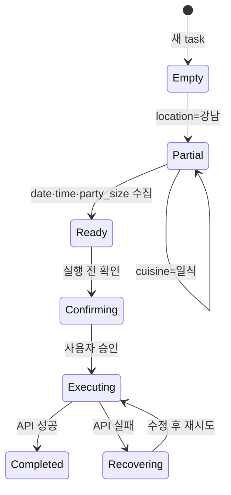

### State update의 주요 패턴

#### 새 값 추가

```text
이전: location=강남, time=?
발화: “7시쯤.”
이후: location=강남, time=19:00
```

#### 값 수정

```text
이전: time=19:00
발화: “아, 8시로 바꿔줘.”
이후: time=20:00
```

#### 값 제거

```text
이전: cuisine=일식
발화: “음식 종류는 상관없어.”
이후: cuisine=dont_care
```

#### 이전 결과 참조

```text
발화: “두 번째 식당으로 해줘.”
필요한 state: 직전 검색 결과 목록 + candidate index mapping
```

#### Task 전환과 복귀

```text
“예약하기 전에 주차 가능한지 확인해줘.”
```

이때 원래 예약 task를 버리면 안 된다. 주차 확인은 임시 subtask가 될 수 있다.

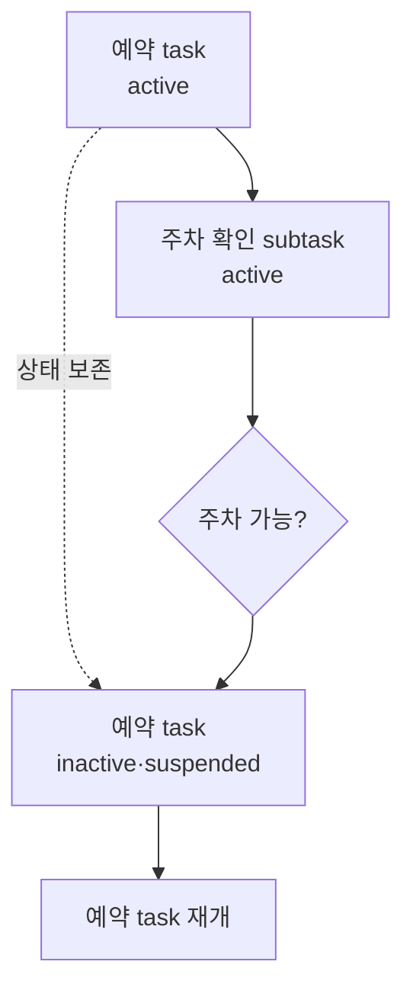

---

## 6. Dialogue Act: 이 발화는 무슨 역할을 하는가?

Intent가 대화 전체의 목표에 가깝다면, Dialogue Act는 **이번 발화가 대화에서 수행하는 기능**이다.

| Dialogue act | 의미 | 예시 |
|---|---|---|
| inform | 정보를 제공 | “두 명이에요.” |
| request | 정보를 요청 | “몇 시로 할까요?” |
| confirm | 확인 | “일식당이 맞나요?” |
| affirm | 동의 | “네, 맞아요.” |
| deny | 부정 | “아니요, 8시예요.” |
| offer | 후보 제안 | “7시와 8시 자리가 있습니다.” |
| notify_success | 성공 알림 | “예약이 완료됐습니다.” |
| notify_failure | 실패 알림 | “해당 시간은 마감됐습니다.” |

하나의 발화에 여러 act가 있을 수 있다.

```text
“7시는 마감됐고, 8시는 가능합니다. 8시로 예약할까요?”
```

```python
[
    notify_failure(time="19:00"),
    offer(time="20:00"),
    confirm(time="20:00")
]
```

---

## 7. Dialogue Manager와 Dialogue Policy

### Dialogue Policy

현재 state를 보고 **다음 action을 선택하는 규칙 또는 모델**이다.

```text
필수 slot이 비어 있음 → 해당 slot 질문
값의 confidence가 낮음 → 사용자 확인
필수 slot이 모두 있음 → DB 검색
고위험 action 직전 → 최종 확인
API 실패 + 재시도 가능 → 해당 단계만 재시도
성공 → 결과 요약 후 종료
```

### Dialogue Manager

Dialogue Manager는 state, policy, backend 결과, 응답 흐름을 조율하는 **관제탑**이다.

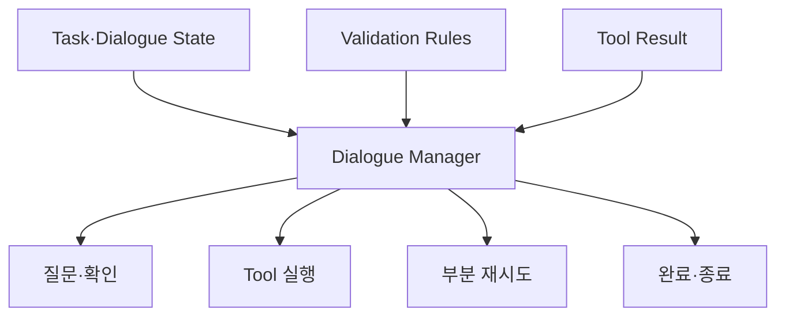

Dialogue Manager가 반드시 거대한 AI 모델일 필요는 없다. 다음을 조합할 수 있다.

- rule-based policy
- finite state machine
- flow/workflow engine
- learned policy
- LLM decision + deterministic guardrail

### Rule-based 예시

```python
def next_action(state):
    if state["date"] is None:
        return Request("date")
    if state["time"] is None:
        return Request("time")
    if not state["user_confirmed"]:
        return Confirm(summary=state)
    return CallTool("reserve_restaurant", arguments=state)
```

이런 규칙은 단순해 보이지만 중요한 업무에서는 오히려 장점이 있다.

- 행동 경로를 설명할 수 있다.
- 누락된 값이 무엇인지 명확하다.
- 결제·예약 전 확인을 강제할 수 있다.
- 실패한 단계만 정확히 재시도할 수 있다.
- 작은 모델의 추론 부담을 줄인다.

---

## 8. Grounding: 서로 같은 것을 말하고 있는가?

Grounding은 시스템과 사용자가 같은 의미·대상·상태를 공유하고 있는지 확인하는 과정이다.

### Explicit grounding

시스템이 직접 확인한다.

```text
“내일 오후 7시, 강남 일식당을 찾으시는 게 맞나요?”
```

### Implicit grounding

다음 질문이나 응답 속에 이해한 내용을 자연스럽게 포함한다.

```text
“내일 오후 7시 강남의 일식당을 몇 분이 이용하시나요?”
```

### 언제 확인해야 할까?

모든 값을 매번 확인하면 대화가 너무 길어진다. 따라서 위험과 불확실성을 함께 본다.

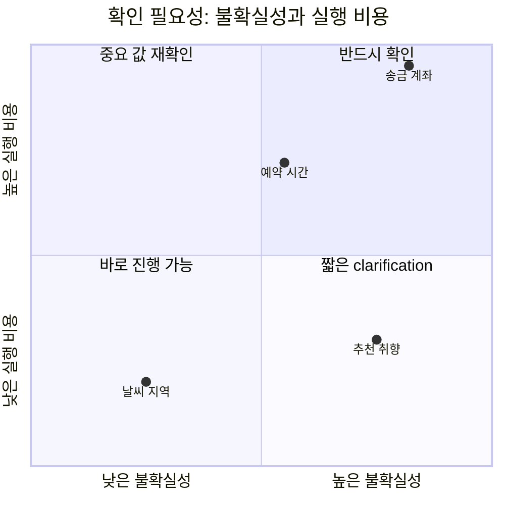

핵심 원칙은 다음과 같다.

> **확신도가 낮고 실패 비용이 높을수록 명시적 확인이 필요하다.**

---

## 9. Error Recovery: 틀렸을 때 처음부터 다시 하지 않기

### Misunderstanding

시스템이 이해했다고 생각했지만 틀린 경우다.

```text
사용자: 일식집 찾아줘.
시스템 state: cuisine=한식
```

자신 있게 잘못 실행할 수 있어 위험하다.

### Non-understanding

시스템이 이해하지 못했다는 사실을 아는 경우다.

```text
“죄송하지만 음식 종류를 이해하지 못했습니다.”
```

불편하지만 잘못된 행동을 하는 것보다 안전하다.

### 복구 전략

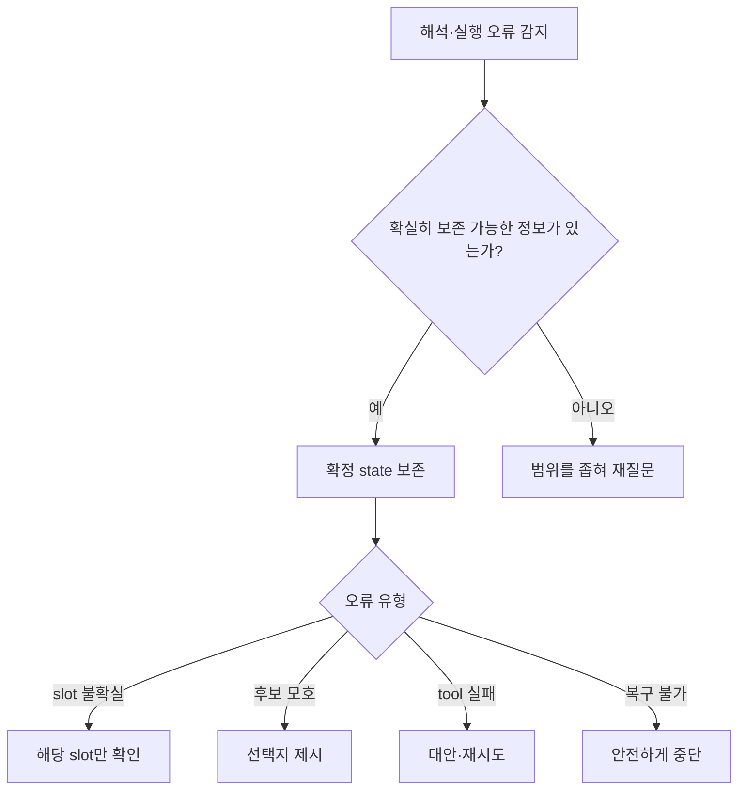

좋지 않은 복구:

```text
사용자: 내일 강남에서 두 명, 7시 일식집 예약해줘.
시스템: 이해하지 못했습니다. 다시 말씀해주세요.
```

좋은 복구:

```text
시스템: 강남, 내일 오후 7시, 두 분까지 확인했습니다.
음식 종류만 다시 말씀해주시겠어요?
```

### 복구의 핵심

- 이미 확보한 slot은 보존한다.
- 실패한 slot이나 단계만 다시 처리한다.
- 사용자가 무엇을 다시 말해야 하는지 구체적으로 알려준다.
- 선택지를 줄 수 있으면 자유 발화를 강요하지 않는다.
- 행동 비용이 크면 자동 추측보다 확인을 우선한다.

---

## 10. ASR 평가: Word Accuracy보다 Slot Accuracy가 중요한 이유

음성 기반 시스템에서는 인식된 문장이 원문과 얼마나 같은지보다 **업무에 필요한 핵심 값이 맞는지**가 더 중요할 수 있다.

### 단어는 거의 맞지만 task는 실패

```text
원문: 내일 저녁 7시에 스시하나 예약해줘.
인식: 내일 저녁 8시에 스시하나 예약해줘.
```

단어 하나만 틀렸지만 예약 시간이라는 핵심 slot이 틀렸다.

### 문장 표면은 다르지만 task는 성공

```text
원문: 어, 그러니까 내일 저녁 7시에 스시하나 좀 예약해줘.
인식: 내일 7시 스시하나 예약.
```

많은 단어가 사라졌지만 핵심 slot은 모두 맞았다.

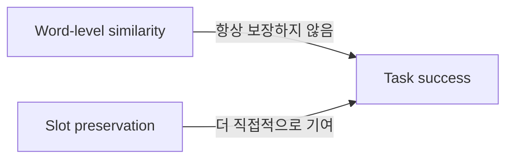

따라서 task-oriented ASR에서는 WER뿐 아니라 slot error rate와 downstream task success를 함께 봐야 한다.

---

## 11. NLG: 자연스러움보다 정보 보존

DB 결과가 다음과 같다고 하자.

```json
{
  "restaurant_name": "스시하나",
  "location": "강남",
  "time": "19:00",
  "party_size": 2,
  "status": "confirmed"
}
```

NLG의 역할은 이를 정확한 응답으로 만드는 것이다.

```text
“강남 스시하나에 오늘 오후 7시, 두 분으로 예약했습니다.”
```

### Template NLG

```python
f"{location} {restaurant_name}에 {time}, {party_size}명으로 예약했습니다."
```

장점:

- 핵심 slot 누락 가능성이 낮다.
- DB에 없는 사실을 만들 가능성이 낮다.
- 표현과 동작 상태를 통제하기 쉽다.

단점:

- 표현이 반복되고 기계적일 수 있다.
- 복잡한 상황을 자연스럽게 설명하기 어렵다.

### Neural/LLM NLG

장점:

- 자연스럽고 문맥에 맞는 표현이 가능하다.
- 복잡한 결과를 요약하기 쉽다.

단점:

- 식당명·시간·상태 같은 핵심 slot을 누락할 수 있다.
- 실제로 예약되지 않았는데 완료된 것처럼 말할 수 있다.
- 필요 이상으로 길게 말하는 over-generation이 생길 수 있다.

> **자연스러운 문장을 쓰는 능력과, 필요한 정보를 정확히 보존하는 능력은 별개다.**

### 실용적인 hybrid NLG

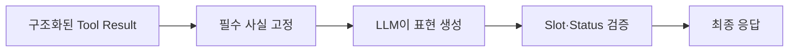

- 필수 사실은 structured data에서 가져온다.
- LLM은 말투와 설명을 담당한다.
- validator가 slot 누락, 값 변경, 실행 상태 왜곡을 검사한다.

---

## 12. Delexicalization

Delexicalization은 구체적인 값을 그 역할을 나타내는 slot token으로 바꾸는 것이다.

```text
“인도 음식 먹고 싶어.”
“한식 먹고 싶어.”
“멕시코 음식 먹고 싶어.”
```

이를 일반화하면:

```text
“<CUISINE> 음식 먹고 싶어.”
```

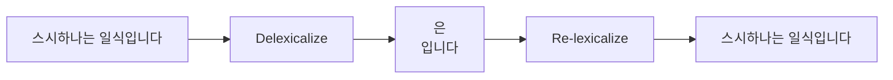

### 왜 하는가?

- 고유명사를 모두 외우지 않고 문장 구조를 학습할 수 있다.
- 처음 보는 상호명도 DB에서 복사해 넣을 수 있다.
- 모델이 중요한 값을 임의 생성하는 위험을 줄인다.
- structured generation, pointer/copy mechanism과 연결된다.

현재 관점에서는 **모델이 사실을 새로 쓰게 하기보다 신뢰할 수 있는 source의 값을 복사하게 한다**는 설계 원칙으로 이해하면 된다.

---

## 13. End-to-End 시스템은 Pipeline을 없앴는가?

완전히 없앴다기보다 여러 단계를 neural network 내부에서 함께 학습하도록 연결한 것이다.

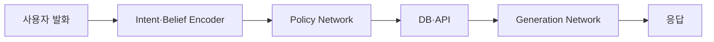

하지만 현실의 DB와 API는 neural network가 아니며, 예약·결제 결과의 정확성은 별도로 보장해야 한다. 따라서 실제 시스템은 여전히 hybrid가 합리적이다.

| 역할 | 적합한 구현 |
|---|---|
| 자유로운 언어 해석 | LLM/neural model |
| task state | structured object/state store |
| 유효성 검사 | deterministic validator |
| 실제 실행 | API/tool |
| 위험한 단계의 승인 | rule/guardrail |
| 자연어 설명 | LLM 또는 template+LLM |

> 모델이 하나로 합쳐졌다고 해서 시스템의 논리적 책임까지 사라진 것은 아니다.

---

## 14. Module 8과 현대 Tool Calling의 관계

“Module 8이 tool calling의 전신”이라는 표현은 절반만 맞다.

정확한 표현은 다음과 같다.

> **Intent-slot 기반 task dialogue는 현대 LLM이 tool을 이용해 여러 turn의 업무를 완수하는 agent workflow의 개념적 선조다. Tool calling은 그 구조 중 ‘자연어를 실행 가능한 함수와 인자로 변환하는 인터페이스’를 일반화한 것이다.**

### 직접 대응되는 부분

| 전통적 dialogue system | 현대 tool calling/agent |
|---|---|
| Intent | 사용자 목표 또는 선택할 action/tool |
| Slot | Tool argument 후보 |
| Slot schema | JSON Schema |
| Slot filling | Argument 생성·보완 |
| Dialogue state | Task state, memory, workflow state |
| Dialogue policy | 질문·호출·재시도·종료 결정 |
| Backend action | Tool/API 실행 |
| NLG | Tool result를 사용자에게 설명 |

### 하지만 1:1 대응은 아니다

#### Intent ≠ Tool

하나의 intent를 수행하려면 여러 tool이 필요할 수 있다.

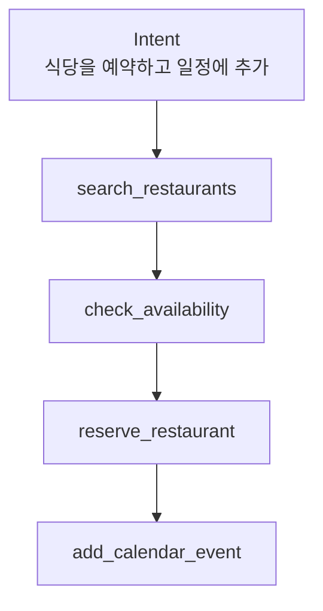

Intent는 상위 목표이고, tool은 목표를 수행하는 원자적 수단에 가깝다.

#### Slot ≠ 한 번의 Tool Argument

Slot은 여러 turn 동안 유지될 수 있지만 tool argument는 보통 한 번의 호출에 전달되는 입력이다.

```python
# 여러 turn에 걸친 task state
booking_state = {
    "location": "강남",
    "date": "내일",
    "time": None
}

# 현재 tool call의 arguments
search_restaurants({
    "location": "강남",
    "date": "2026-08-02"
})
```

#### Tool calling ≠ Dialogue Manager

Tool calling 인터페이스가 자동으로 다음 정책을 제공하는 것은 아니다.

- 누락된 값이 있으면 무엇을 질문할지
- 결제 전에 확인받을지
- 이전 값을 어떻게 수정할지
- tool 실패 시 어느 단계로 돌아갈지
- 여러 task 중 어느 것이 active인지
- 완료 조건이 무엇인지

이것들은 여전히 agent runtime, workflow engine, Dialogue Manager, 애플리케이션 코드가 담당해야 한다.

??? question "Q-20260802-01 · Task-oriented dialogue는 정말 Tool Calling의 전신인가?"
    **질문**

    전통적인 task-oriented dialogue는 식당 예약처럼 굉장히 특정한 workflow인데,
    이것을 현대 tool calling의 전신이라고 불러도 될까?

    **답변**

    전체 구조를 tool calling의 직접적인 전신이라고 부르면 너무 넓은 표현이다.
    자연어를 `action + arguments`로 구조화하는 intent-slot 부분은 tool calling과 직접 대응한다.
    반면 여러 turn의 상태, 확인, 재시도, 완료 조건까지 관리하는 전체 구조는
    현대적인 **agent workflow·orchestration의 개념적 선조**에 더 가깝다.

    **이해한 결론**

    > Tool calling은 실행 인터페이스이고, task-oriented dialogue의 더 큰 유산은
    > stateful agent workflow다.

    `상태: integrated`

---

## 15. 실제 현대 시스템에서 얼마나 남아 있는가?

전통 구조가 모든 범용 챗봇에 그대로 들어가는 것은 아니다. 업무의 범위와 실패 비용에 따라 달라진다.

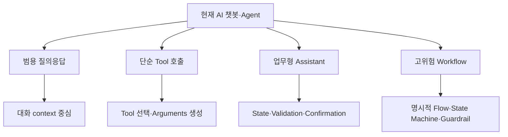

| 시스템 성격 | 전통 구조의 사용 정도 |
|---|---|
| 범용 Q&A | 명시적 intent-slot pipeline이 거의 드러나지 않음 |
| 단일 tool 호출 | tool 선택과 argument 생성만 사용 |
| 예약·주문·고객센터 | slot, state, validation, confirmation을 적극 사용 |
| 금융·결제·의료 행정 | workflow/state machine과 승인 규칙을 강하게 유지 |

범용 대화 단계에서는 자유로운 LLM 추론이 편리하다. 그러나 실제 행동 단계에서는 다시 특정 workflow로 좁혀진다.

```text
자유 대화
→ 사용자 목표 파악
→ 적절한 tool/workflow 선택
→ 필요한 인자 수집
→ 검증·확인
→ 실행
→ 결과 검증·설명
```

??? question "Q-20260802-02 · 현재 AI 챗봇도 이 구조를 실제로 쓰는가?"
    **질문**

    고전적인 NLU → DST → Dialogue Manager pipeline이 지금의 AI 챗봇에도 그대로 들어가 있는가?

    **답변**

    범용 챗봇 전체가 이 모듈들로 고정되어 있다고 보기는 어렵다. LLM 하나가 언어 이해,
    상태 추정, 응답 생성을 암묵적으로 함께 처리할 수 있기 때문이다. 하지만 예약·주문·결제처럼
    실제 행동의 실패 비용이 있는 구간에서는 structured state, schema validation,
    confirmation, workflow routing이 다시 명시적으로 등장한다.

    즉 **모델 내부의 고전 모듈 경계는 흐려졌지만, 시스템 수준의 책임은 남아 있다.**

    `상태: integrated`

---

## 16. 작은 모델에서 Dialogue Manager가 특히 중요한 이유

작은 모델은 tool을 호출하는 형식 자체보다 **호출 전후의 긴 작업 상태와 분기**를 처리하는 데 어려움을 겪을 수 있다.

- 현재 목표와 이전 요구사항을 계속 유지하기
- 긴 tool output에서 필요한 값만 추출하기
- 결과에 따라 다음 tool을 선택하기
- 실패 원인을 판정하고 일부 단계만 재시도하기
- 사용자의 수정 요청을 기존 조건과 충돌 없이 반영하기
- 작업 완료 여부를 정확히 판단하기

### 단순 Instruction Sequence

```text
1. 요구사항 추출
2. 입력 검증
3. Tool 실행
4. 결과 검사
5. 사용자에게 반환
```

예상된 직선 경로에는 강하지만, 사용자가 “두 번째 결과로 돌아가서 색만 바꿔줘”처럼 중간 상태를 참조하면 취약하다.

### Dialogue Manager를 둔 구조

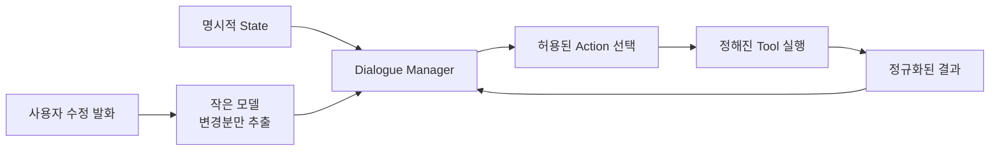

```python
state = {
    "phase": "refinement",
    "selected_candidate": 2,
    "locked": ["texture", "logo", "geometry"],
    "editable": ["color_brightness"],
    "next_allowed_actions": [
        "regenerate_selected_candidate",
        "ask_clarification",
        "cancel"
    ]
}
```

이때 작은 모델은 전체 workflow를 발명할 필요가 없다.

```text
사용자 발화에서 변경사항 추출
→ 현재 phase에 허용된 action 중 하나 선택
→ 필요한 arguments만 채움
```

### Tool output도 작고 일정하게

작은 모델에게 원본 로그와 복잡한 결과를 모두 읽히기보다 validator가 정규화한다.

```json
{
  "generation": "success",
  "candidate_count": 8,
  "logo_preservation": "fail",
  "geometry_preservation": "pass",
  "retryable": true,
  "recommended_action": "retry_with_stronger_logo_mask"
}
```

### 네 가지 접근의 연속선

| 방식 | 다음 행동 결정 | 장점 | 약점 |
|---|---|---|---|
| 고정 instruction sequence | 항상 같은 순서 | 단순하고 재현 가능 | 예외·되돌아가기 취약 |
| 조건부 workflow | 미리 정한 분기 | 안정성과 유연성의 균형 | 상태 설계 필요 |
| Dialogue Manager | state와 규칙으로 질문·실행·복구 | multi-turn과 부분 복구에 강함 | 구현 복잡도 증가 |
| 완전 자율 agent | 모델이 즉석 계획 | 열린 문제에 유연 | 작은 모델에는 부담, 통제 어려움 |

> Dialogue Manager는 모델을 더 똑똑하게 만드는 장치가 아니라, **모델이 매번 모든 것을 추론하지 않아도 되도록 추론 범위를 줄이는 시스템 구조**다.

??? question "Q-20260802-03 · 작은 모델은 왜 Instruction Sequence만으로 부족한가?"
    **질문**

    해야 할 순서를 instruction으로 길게 써주면 되지 않을까? 왜 별도의 Dialogue Manager가 필요한가?

    **답변**

    고정 instruction은 정상적인 직선 경로를 설명할 수 있지만, 실행 중 생기는 상태를 신뢰성 있게
    보관하지는 않는다. 사용자가 이전 후보를 다시 선택하거나, 일부 조건만 수정하거나, tool이 중간에
    실패하면 모델은 긴 문맥에서 현재 단계·확정 조건·재시도 지점을 다시 추론해야 한다.

    Dialogue Manager는 이를 외부 state와 허용 action으로 좁힌다. 작은 모델은 전체 절차를 기억하는 대신
    **이번 발화의 변경분을 추출하고 제한된 다음 행동 중 하나를 고르는 일**에 집중할 수 있다.

    `상태: integrated`

---

## 17. CMF Generation에 적용하기

CMF Generation은 Module 8의 구조가 잘 맞는 업무형 AI 시스템이다. 단, 이 구조는 diffusion model 내부가 아니라 **생성 모델을 둘러싼 대화형 생성·검증 workflow**에 들어간다.

예시 요청:

> “이 휴대폰 백커버를 좀 더 고급스러운 블루 계열로 여러 개 만들어줘. 로고와 카메라는 유지하고.”

### 17.1 Intent와 Slot

```python
CMFGenerationState(
    intent="generate_variations",
    product="smartphone_backcover",
    editable_region="backcover_mask",
    protected_regions=["logo", "camera", "product_geometry"],
    color_family="blue",
    style_keyword="premium",
    material=None,
    finish=None,
    gloss_level=None,
    num_variations=8,
    status="needs_grounding"
)
```

| Dialogue 개념 | CMF Generation에서의 의미 |
|---|---|
| Intent | 생성, 수정, 비교, 선택, 확정, 저장 |
| Slot | 색상, 재질, 광택, 패턴, 마스크, 보존 영역 |
| Frame | 하나의 CMF generation spec |
| Belief/task state | 확정·추정·미확정 디자인 조건 |
| Policy | 질문, 생성, 평가, 재생성, 저장 중 다음 행동 |
| Tool calling | segmentation, inpainting, scoring, 저장 |
| Grounding | “고급스럽게”를 실제 CMF parameter로 합의 |
| Task success | 요구 조건을 지킨 usable result 확보 |

### 17.2 모호한 표현 Grounding

“고급스럽게”는 직접 실행 가능한 parameter가 아니다.

```python
{
    "finish_candidates": ["satin", "matte_metallic"],
    "gloss_level": "low_to_medium",
    "color_saturation": "low",
    "texture_scale": "fine"
}
```

시스템은 다음처럼 물을 수 있다.

> “고급스러운 블루를 저채도 메탈릭 새틴으로 해석할까요, 아니면 무광 유리 느낌으로 해석할까요?”

여기서 LLM은 CMF 언어를 구조화된 parameter 후보로 번역하고, 사용자는 그 의미를 확정한다.

### 17.3 상태를 세 층으로 분리

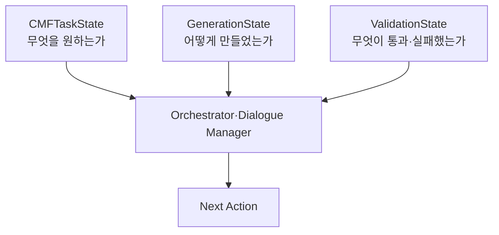

#### CMFTaskState

사용자 의도와 디자인 사양의 SoT.

```python
{
    "color": "deep_desaturated_blue",
    "material": "glass",
    "finish": "satin",
    "gloss": 0.25,
    "protected_regions": ["logo", "camera", "edge"]
}
```

#### GenerationState

재현과 refinement에 필요한 생성 이력.

```python
{
    "model": "flux-dev",
    "seed": 1729,
    "source_image": "phone_A.png",
    "mask_id": "backcover_v3",
    "parent_candidate": 2,
    "generation_round": 3
}
```

#### ValidationState

자동 검사와 사용자 승인을 구분한다.

```python
{
    "mask_boundary": "pass",
    "logo_preservation": "pass",
    "geometry_preservation": "pass",
    "cmf_spec_match": 0.87,
    "user_approved": False
}
```

### 17.4 전체 CMF Workflow

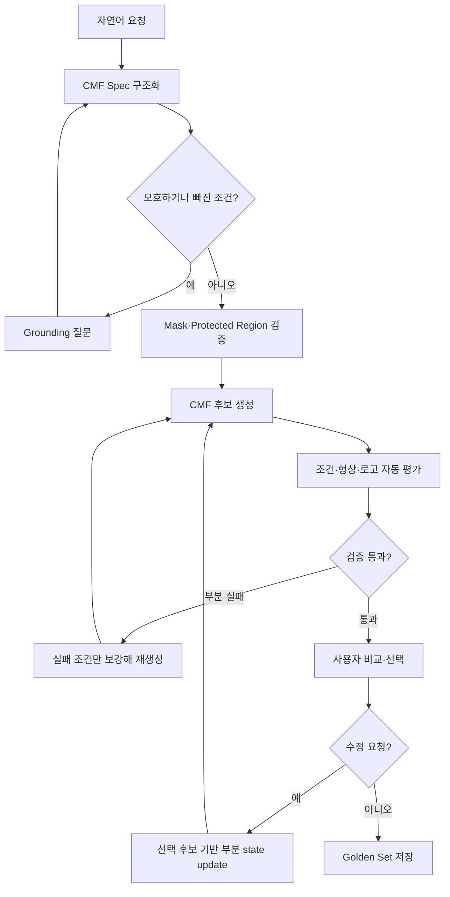

### 17.5 부분 수정: 전체 Prompt를 다시 해석하지 않기

사용자:

> “두 번째가 좋은데 조금 더 어둡게 하고 광택은 줄여줘. 로고는 그대로 둬.”

State delta:

```python
{
    "base_candidate": 2,
    "updates": {
        "color_brightness": {"operation": "decrease", "amount": 0.15},
        "gloss_level": "low"
    },
    "locked": ["logo", "texture", "geometry"]
}
```

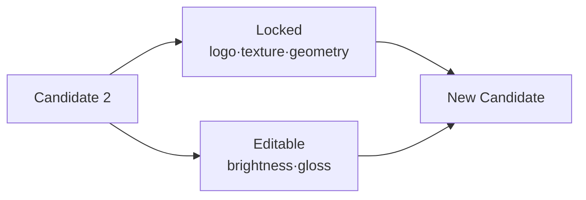

핵심은 이전 prompt 전체를 다시 생성하는 것이 아니라 **변경분(delta)** 과 **고정 조건(lock)** 을 분리하는 것이다.

### 17.6 부분 실패 복구

```python
validation_result = {
    "cmf_match": "pass",
    "logo_preservation": "fail",
    "geometry_preservation": "fail"
}
```

Dialogue policy:

```text
CMF 조건과 seed 유지
→ 로고·형상 protected mask 강화
→ 실패한 후보만 재생성
→ preservation validator 재실행
```

전통 dialogue system의 원칙과 같다.

> 확보한 slot은 유지하고 실패한 slot만 다시 받는다.  
> 성공한 생성 조건은 유지하고 실패한 제약만 다시 처리한다.

### 17.7 CMF에서 작은 모델과 Dialogue Manager의 역할 분담

| 구성 요소 | 책임 |
|---|---|
| 작은 LLM | 자연어에서 CMF 조건·수정 delta 추출, 사용자 설명 |
| Dialogue Manager | phase, 확정 조건, active candidate, 다음 action 관리 |
| Workflow | 생성·평가·재생성·승인의 허용된 경로 정의 |
| Tools | mask 검사, inpainting, preservation 평가, 저장 |
| Validator | raw output을 작고 일관된 결과로 정규화 |
| State store | task/generation/validation 이력의 SoT 유지 |

이 구조는 완전 자율 agent보다 통제 가능하고, 고정 instruction sequence보다 multi-turn refinement에 강하다.

??? example "Q-20260802-04 · Dialogue Manager를 CMF Generation에 쓸 수 있는가?"
    **질문**

    CMF variation처럼 마스크 영역을 생성하고 결과를 반복 수정하는 시스템에도
    Dialogue Manager 개념을 적용할 수 있을까?

    **답변**

    잘 맞는다. 다만 diffusion model 내부를 바꾸는 기법이 아니라 모델 바깥에서
    `요구사항 구조화 → 모호성 질문 → 생성 → 보존 조건 검증 → 부분 재시도 → 사용자 승인`을
    관리하는 orchestration으로 적용한다.

    특히 선택 후보, 고정할 속성, 수정할 delta, mask·logo·geometry 검증 결과를 명시적 state로
    유지하면 “두 번째 결과에서 색만 더 어둡게” 같은 요청을 전체 prompt 재작성 없이 처리할 수 있다.

    `상태: integrated`

---

## 18. Golden Set은 이미지 폴더가 아니라 성공한 Task State다

좋은 결과 이미지만 저장하면 왜 성공했는지 재현하거나 학습하기 어렵다. Golden set에는 입력, 구조화된 spec, 생성 이력, 검증 결과, 사용자 피드백을 함께 저장해야 한다.

```json
{
  "source_image": "phone_A.png",
  "mask_id": "backcover_v3",
  "protected_regions": ["logo", "camera", "edge"],
  "cmf_spec": {
    "color": "deep_desaturated_blue",
    "material": "glass",
    "finish": "satin",
    "gloss": 0.25
  },
  "generation": {
    "model": "flux-dev",
    "seed": 1729,
    "parent_candidate": 2
  },
  "user_feedback": [
    "candidate_2 selected",
    "reduce gloss",
    "darken color"
  ],
  "validation": {
    "logo_preserved": true,
    "geometry_preserved": true,
    "cmf_approved": true
  }
}
```

### Golden Set의 활용

```mermaid
flowchart TD
    G["Golden Set<br/>Image + State + History"] --> R["유사 요청 Reference Retrieval"]
    G --> P["Prompt·Parameter 추천"]
    G --> E["자동 Evaluator 학습"]
    G --> K["Candidate Ranking 학습"]
    G --> T["성공 Workflow 재현"]
    G --> X["Model·Prompt Regression Test"]
```

즉 Golden set은 단지 “예쁜 결과 모음”이 아니라 **성공한 조건과 의사결정 경로의 데이터셋**이다.

---

## 19. 로보틱스·VLA와의 연결

로봇 명령:

> “주방에 있는 빨간 컵을 가져와서 내 책상 위에 놔줘.”

### Intent와 Slot

```python
{
    "intent": "move_object",
    "object": "cup",
    "color": "red",
    "source_location": "kitchen",
    "destination": "user_desk"
}
```

하지만 언어 state만으로는 부족하다. 실제 장면의 world state가 필요하다.

```mermaid
flowchart TD
    L["언어 명령"] --> IS["Intent·Slot"]
    V["시각·센서 인식"] --> WS["World State"]
    IS --> G["Grounding"]
    WS --> G
    G --> DS["Dialogue + World State"]
    DS --> P["행동 계획"]
    P --> A["로봇 실행"]
```

빨간 컵이 두 개라면 시스템은 바로 집으면 안 된다.

> “주방 테이블 위 컵과 싱크대 옆 컵 중 어느 것인가요?”

### Symbol grounding과 Dialogue grounding

| 개념 | 질문 |
|---|---|
| Symbol grounding | “빨간 컵”이라는 언어 표현이 실제 어느 visual object인가? |
| Dialogue grounding | 사용자와 시스템이 같은 빨간 컵을 가리킨다고 합의했는가? |

로봇이 해야 할 일을 기억하지 못한다는 문제도 결국 상태 문제다.

- 목표가 무엇인가?
- 어떤 물체가 target인가?
- destination은 어디인가?
- 지금 어느 단계까지 수행했는가?
- 실패한 단계는 무엇인가?
- 사용자의 추가 지시가 기존 목표를 수정한 것인가, 새 task인가?

따라서 VLA나 robot agent에서도 raw conversation/token context와 별개로 **task state와 execution state**가 필요하다.

---

## 20. 평가: 말이 아니라 일을 봐야 한다

Task-oriented system은 BLEU 같은 문장 유사도만으로 평가하면 안 된다.

| 평가 대상 | 대표 지표 | 확인하려는 것 |
|---|---|---|
| Intent 이해 | Intent accuracy | 사용자의 목표를 맞췄는가 |
| Slot 추출 | Precision, Recall, F1 | 필요한 값을 정확히 추출했는가 |
| 전체 상태 | Joint goal/state accuracy | 한 turn의 전체 state가 맞는가 |
| 음성 핵심 정보 | Slot error rate | 업무상 중요한 값이 보존됐는가 |
| 대화 효율 | Turn 수 | 불필요한 왕복이 적은가 |
| 실제 목표 | Task success rate | 일이 실제로 완료됐는가 |
| 생성 문장 | BLEU, METEOR 등 | 기준 문장과 얼마나 유사한가 |
| 사용자 경험 | Human rating | 이해 가능하고 신뢰할 만한가 |

```mermaid
flowchart TD
    Q["좋은 Task-oriented System"] --> A["정확한 이해"]
    Q --> B["정확한 State"]
    Q --> C["안전한 실행"]
    Q --> D["효율적인 대화"]
    Q --> E["사실을 보존한 응답"]
    A --> S["Task Success"]
    B --> S
    C --> S
    D --> S
    E --> S
```

예시:

```text
시스템 A: 매우 자연스럽지만 예약 성공률 60%
시스템 B: 다소 기계적이지만 예약 성공률 95%
```

Task-oriented dialogue에서는 B가 더 좋은 시스템일 수 있다.

단, turn 수가 짧다고 무조건 좋은 것도 아니다. 한 번에 틀린 예약을 완료하면 짧지만 실패다.

> **최소한의 불필요한 대화로 필요한 정보를 정확히 수집하고, 실제 목표를 안전하게 성공시켰는가?**

CMF에서는 이를 다음처럼 바꿀 수 있다.

| Dialogue 평가 | CMF 대응 평가 |
|---|---|
| Intent accuracy | 생성·수정·비교·확정 의도 분류 정확도 |
| Slot F1 | 색상·재질·광택·보존 조건 추출 정확도 |
| State accuracy | 누적 CMF spec 및 lock 상태 정확도 |
| Task success | 사용자가 승인할 usable variation 생성 |
| Error recovery | 실패 조건만 보정하여 성공했는가 |
| Turn efficiency | 승인까지 필요한 refinement 횟수 |
| NLG factuality | tool 결과·검증 상태를 왜곡하지 않았는가 |

---

## 21. 자주 헷갈리는 구분

### Intent vs Dialogue Act

```text
Intent: 전체적으로 무엇을 하려는가? → 식당 예약
Dialogue act: 이번 발화가 무슨 역할인가? → 시간 제공, 후보 거절, 최종 확인
```

### Context vs State

```text
Context: 지금까지 무슨 말을 했는가?
State: 현재 업무상 확정·추정된 사실과 진행 단계는 무엇인가?
```

### Slot vs Tool Argument

```text
Slot: 여러 turn 동안 유지되는 task 정보
Tool argument: 특정 tool을 호출할 때 전달하는 입력
```

### Intent vs Tool

```text
Intent: 사용자의 상위 목표
Tool: 목표 달성에 사용하는 실행 수단
```

### Dialogue Manager vs LLM

```text
LLM: 언어 이해·생성·제한된 판단을 잘함
Dialogue Manager: 상태와 허용된 흐름을 일관되게 관리함
```

### Natural response vs Correct response

```text
자연스러움: 사람이 읽기 편한가?
정확성: 실제 값과 실행 상태를 보존했는가?
```

### Misunderstanding vs Non-understanding

```text
Misunderstanding: 틀리게 이해했지만 안다고 생각함
Non-understanding: 이해하지 못했음을 알고 있음
```

---

## 22. 현대 Agent 설계 체크리스트

### State

- [ ] 대화 원문과 task state를 분리했는가?
- [ ] 각 slot의 출처, confidence, confirmed 여부가 필요한가?
- [ ] 사용자 수정은 전체 재해석이 아니라 delta update로 처리되는가?
- [ ] 여러 task의 active/inactive/suspended 상태를 표현할 수 있는가?
- [ ] tool execution state와 user goal state를 구분했는가?

### Policy

- [ ] 어떤 slot이 필수인지 정의했는가?
- [ ] 언제 질문하고 언제 자동 진행할지 기준이 있는가?
- [ ] 고위험 action 전에 확인을 강제하는가?
- [ ] 실패한 단계만 재시도할 수 있는가?
- [ ] 명시적인 완료 조건이 있는가?

### Tool과 Validator

- [ ] Tool input이 schema로 제한되는가?
- [ ] Tool output을 작은 공통 형식으로 정규화하는가?
- [ ] raw log를 그대로 작은 모델에게 넘기지 않는가?
- [ ] 실제 성공과 모델이 말하는 성공을 구분하는가?
- [ ] retryable/non-retryable 오류가 구분되는가?

### NLG

- [ ] 핵심 slot과 action status가 반드시 포함되는가?
- [ ] DB·tool에 없는 정보를 생성하지 않는가?
- [ ] over-generation 때문에 완료 여부가 흐려지지 않는가?
- [ ] 중요한 응답은 template 또는 post-validator로 보호하는가?

### 평가

- [ ] 자연스러움 외에 task success를 측정하는가?
- [ ] slot/state accuracy를 독립적으로 볼 수 있는가?
- [ ] 실패 원인을 module/phase별로 추적할 수 있는가?
- [ ] recovery 성공률과 refinement turn 수도 기록하는가?

---

## 23. 최종 Mental Model

```mermaid
flowchart TD
    U["Natural Language<br/>사람이 원하는 것"] --> I["Intent·Slot·Grounding<br/>실행 가능한 의미"]
    I --> S["Task State<br/>현재까지 알고 있는 것"]
    S --> P["Policy·Dialogue Manager<br/>다음 행동"]
    P --> T["Tool·DB·Robot·Generator<br/>실제 세계의 변화"]
    T --> V["Validation<br/>정말 성공했는가"]
    V --> S
    V --> N["NLG<br/>사실을 보존한 설명"]
    N --> U
```

이 구조를 한 문장으로 기억하면 된다.

> **자연어를 곧바로 행동으로 보내지 말고, 구조화된 state로 바꾼 뒤 policy와 validation을 거쳐 행동하게 한다.**

Module 8의 오래된 용어들은 현재도 다음 이름으로 살아 있다.

```text
Intent·Slot      → Structured extraction / Tool arguments
Belief State     → Task state / Agent memory
Dialogue Policy  → Orchestration / Workflow routing
Backend Action   → Tool calling
Grounding        → Clarification / Confirmation
Error Recovery   → Retry / Fallback / Partial rollback
NLG              → Tool-result response generation
Task Success     → End-to-end agent evaluation
```

그리고 CMF Generation에서는 다음처럼 읽을 수 있다.

> **사용자가 prompt를 쓰고 이미지를 받는 기능이 아니라, CMF specification을 점진적으로 완성하고 생성·검증·수정·승인하는 stateful task system을 만든다.**

---

## 24. 1분 복습 카드

### 카드 1

**Q. Dialogue context와 belief state의 차이는?**  
A. Context는 원문 대화이고, belief state는 현재 업무를 수행하기 위해 구조화·정규화한 시스템의 추정 상태다.

### 카드 2

**Q. Intent와 tool은 같은가?**  
A. 아니다. Intent는 사용자의 상위 목표이고, 하나의 intent를 수행하기 위해 여러 tool이 필요할 수 있다.

### 카드 3

**Q. Slot과 tool argument는 같은가?**  
A. 닮았지만 slot은 여러 turn에 걸친 task state이고, argument는 한 번의 tool 호출 입력이다.

### 카드 4

**Q. Tool calling만 있으면 Dialogue Manager가 필요 없는가?**  
A. 아니다. 누락 정보 질문, 상태 수정, 확인, 재시도, task 전환, 완료 판단은 별도의 orchestration이 필요하다.

### 카드 5

**Q. 작은 모델에서 Dialogue Manager의 역할은?**  
A. state, 규칙, 허용 action을 외부화하여 모델이 매번 전체 workflow를 추론하지 않게 한다.

### 카드 6

**Q. Error recovery의 가장 중요한 원칙은?**  
A. 이미 확보한 정보는 보존하고 실패한 slot이나 단계만 다시 처리한다.

### 카드 7

**Q. NLG에서 자연스러움보다 중요한 것은?**  
A. 핵심 slot과 실제 tool execution status를 정확히 보존하는 것이다.

### 카드 8

**Q. CMF Generation에 Module 8을 어떻게 적용하는가?**  
A. 자연어 요청을 CMF task state로 만들고, Dialogue Manager가 생성·검증·부분 수정·승인 workflow를 관리하게 한다.

### 카드 9

**Q. Golden set에 이미지 외에 무엇을 저장해야 하는가?**  
A. CMF spec, mask/protected region, model/seed, parent candidate, 수정 이력, validation, 사용자 승인 정보를 함께 저장한다.

### 카드 10

**Q. Module 8의 본질은?**  
A. 언어를 행동으로 바꾸되, state와 policy와 validation을 사이에 두어 정확하고 복구 가능한 시스템을 만드는 것이다.

---

## 25. 아직 열린 질문

- 작은 모델이 CMF state delta를 얼마나 정확히 추출하는지 어떤 benchmark로 측정할까?
- `CMFTaskState`, `GenerationState`, `ValidationState`의 최소 schema는 어디까지여야 할까?
- 사용자 취향처럼 계속 변하는 preference와 한 작업에서만 유효한 slot을 어떻게 분리할까?
- Golden Set의 사용자 승인 신호와 자동 preservation score가 충돌하면 무엇을 우선할까?

## 26. 학습 업데이트 로그

| 날짜 | 업데이트 | 위치 | 상태 |
|---|---|---|---|
| 2026-08-02 | Tool calling의 전신이라는 표현을 agent workflow의 개념적 선조로 정교화 | Q-20260802-01 | integrated |
| 2026-08-02 | 현대 챗봇에서 고전 모듈 경계와 시스템 책임을 구분 | Q-20260802-02 | integrated |
| 2026-08-02 | 작은 모델에서 instruction sequence와 외부 state 관리의 차이 추가 | Q-20260802-03 | integrated |
| 2026-08-02 | Dialogue Manager를 CMF generation·부분 수정 workflow에 연결 | Q-20260802-04 | integrated |
