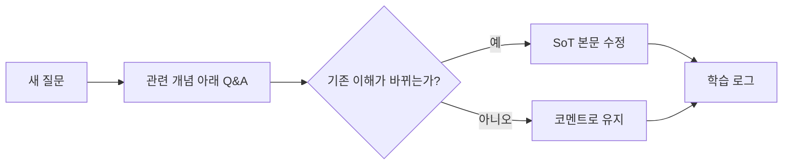

---
hide:
  - navigation
  - toc
---

<section class="concept-hero">
  
Dayo's living AI notes

  <h1>질문이 개념이 되는 곳, Concept Loop</h1>
  

    공부하며 나눈 질의응답을 흘려보내지 않고, 최신 개념 본문과
    질문·정정·응용의 흔적으로 함께 쌓아가는 AI 복습노트입니다.
  

  

    <a class="concept-button concept-button--primary" href="dialogue/task-oriented-dialogue/">첫 노트 읽기</a>
    <button class="concept-button" type="button" data-gipi-action="configure">지피 세션 연결</button>
  

</section>

  
<b>01</b>질문

  <i aria-hidden="true">→</i>
  
<b>02</b>이해

  <i aria-hidden="true">→</i>
  
<b>03</b>정리

  <i aria-hidden="true">→</i>
  
<b>04</b>다시 질문

## 지금 읽을 수 있는 노트

<a class="note-card" href="dialogue/task-oriented-dialogue/">
  MODULE 08
  <strong>Task-Oriented Dialogue</strong>
  
Intent·Slot·DST에서 현대 Tool Calling, 작은 모델용 Dialogue Manager와 CMF Generation까지.

  노트 열기 →
</a>

  NEXT LOOP
  <strong>다음 개념을 기다리는 중</strong>
  
새로운 질문이 생기면 관련 페이지의 코멘트가 되고, 충분히 커지면 독립 노트가 됩니다.

!!! tip "모바일에서 지피에게 이어서 질문하기"
    먼저 **지피 세션 연결**에서 현재 ChatGPT 대화 주소를 한 번만 저장하세요. 이후 노트를 읽다가 문장을 선택하고 화면 아래의 **질문 복사**를 누르면, 문서·문단·선택 문장이 포함된 질문 초안이 복사됩니다. 세션 주소는 이 기기에만 저장되며 공개 저장소로 전송되지 않습니다.

## 이 노트가 쌓이는 방식

본문은 언제나 현재의 이해를 보여주고, 접힌 Q&A와 정정 블록은 이해가 자란 과정을 남깁니다.
