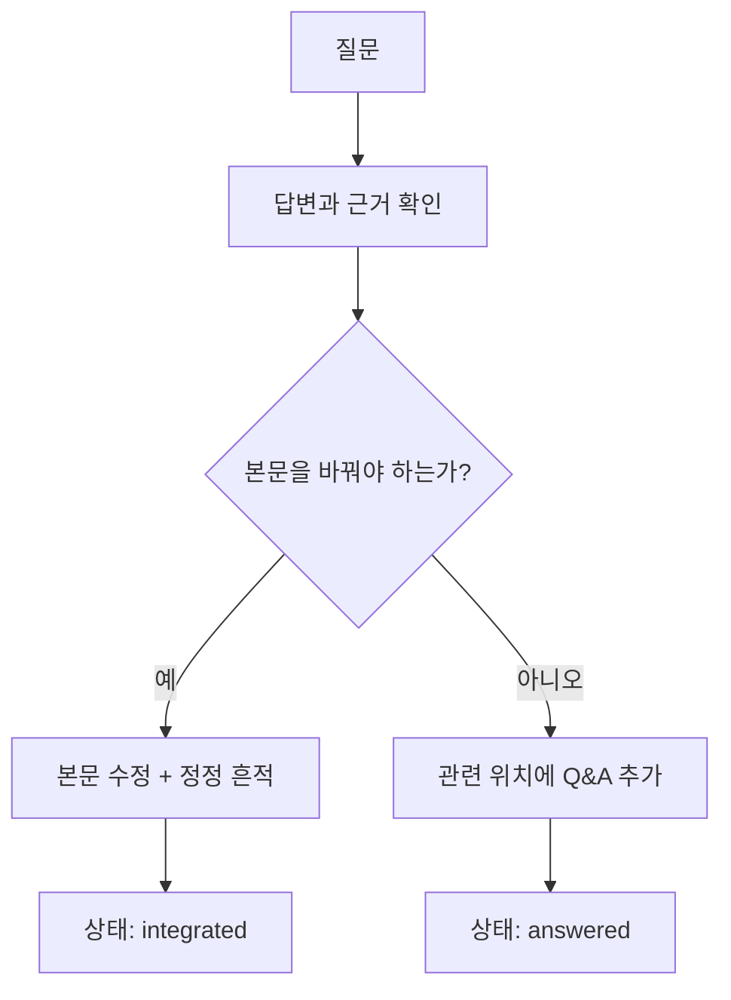

# 질문하고 업데이트하기

Concept Loop는 완성된 교과서가 아니라 **질문을 통해 계속 정확해지는 복습노트**다.

## 모바일에서 질문하는 방법

1. 이 ChatGPT 대화의 주소를 복사한다.
2. 사이트 메뉴의 **지피 세션 연결**을 누르고 주소를 저장한다.
3. 노트에서 궁금한 문장을 길게 눌러 선택한다.
4. 화면 아래의 **질문 복사**를 누른다.
5. **세션 열기**를 눌러 ChatGPT에서 붙여넣고 질문한다.

!!! info "자동 전송은 하지 않음"
    공개된 정적 사이트가 개인 ChatGPT 대화에 직접 메시지를 넣거나 전송할 수는 없다. Concept Loop는 문맥이 담긴 질문 초안을 복사하고, 사용자가 저장한 대화 주소만 연다.

## 복사되는 질문의 형태

```text
[Concept Loop]
문서: Task-Oriented Dialogue
관련 문단: Dialogue Manager와 Dialogue Policy

선택한 내용:
“Dialogue Manager는 대화 상태와 시스템 상태를 관리한다.”

이 부분에 대해 질문할게:
```

세션 주소는 브라우저의 `localStorage`에만 저장된다. 저장소 코드나 GitHub Pages 서버에는 포함되지 않는다. 공용 기기에서는 설정 창의 **연결 해제**를 사용한다.

## 질문 이후 문서 갱신 규칙



- 단순 부연 질문 → 관련 문단 아래 `질문` 블록
- 기존 설명이 부정확함 → 본문 수정 + `정정` 블록
- 새로 얻은 통찰 → `이해한 결론` 블록
- 프로젝트 연결 → `응용` 블록
- 아직 불확실함 → `열린 질문`에 유지
- 내용이 충분히 커짐 → 독립 페이지로 승격
